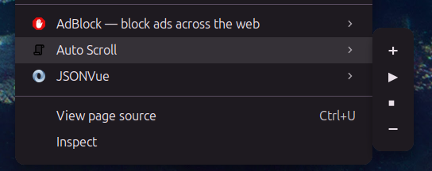
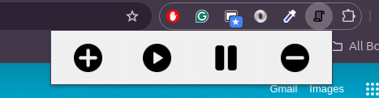

# 🚀 Auto Scroll Chrome Extension

**Auto Scroll** is a lightweight Chrome extension that automatically scrolls webpages and allows users to control the speed using a popup UI and right-click context menu. It also supports targeted scrolling for a selected section.

---

## 📌 Features

✅ **Auto-scroll the entire page**  
✅ **Adjust scroll speed dynamically**  
✅ **Popup UI with Increase (+), Stop (⏹), and Decrease (-) buttons**  
✅ **Right-click context menu to control scrolling**  
✅ **Lightweight and fast performance**  


---

---


---

## 🔧 Installation

1. **Download or clone the repository.**  
2. Open **Google Chrome** and go to `chrome://extensions/`.  
3. Enable **Developer Mode** (top-right corner).  
4. Click **"Load Unpacked"** and select the `google-page-auto-scroll` folder.  
5. The extension will be installed and ready to use! 🎉  

---

## 🎮 How to Use

### 1️⃣ **Popup UI Controls**
- Click the extension icon to open the popup.
- Use the buttons:
  - **➕ (Increase Speed)** - Scroll faster
  - **⏹ (Stop)** - Stop scrolling
  - **➖ (Decrease Speed)** - Scroll slower
  - **▶ (Start)** - Start scroll 

### 2️⃣ **Right-Click Context Menu**
- Right-click anywhere on a webpage.
- Hover over **"Auto Scroll"**, then choose:
  - **➕ Increase Speed**
  - **⏹ Stop**
  - **➖ Decrease Speed**

### 3️⃣ **Select a Target Section**
- Press `Ctrl` and click on a section (div) to scroll only that part of the page.

---

## 🛠️ Customization

- Default scroll speed can be changed in `content.js` and `popup.js`:
  ```js
  window.scrollSpeed = 10;  // Adjust this value
  ```
---


 ## 🤖 Technologies Used
- Manifest V3

- JavaScript

- HTML & CSS

- Chrome Extensions API

---

## 🚀 Future Enhancements (TODO)
- Add keyboard shortcuts for speed control

- Add smooth scrolling animation

- Add scroll for specific section

---

<video width="800" controls>
  <source src="images/screen-capture.mp4" type="video/mp4">
  Your browser does not support the video tag.
</video>

---